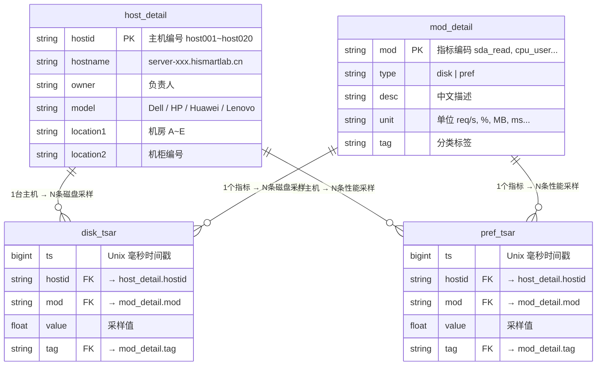

# 数据库监控数据分析报告

> 项目：服务器性能监控数据集（TSAR 格式）  
> 日期：2026-07-08

---

## 1. 数据集概览

| 文件 | 行数 | 角色 | 说明 |
|------|------|------|------|
| `host_detail.dat` | 20 | 维度表 | 主机元数据（编号、名称、负责人、型号、位置） |
| `mod_detail.dat` | 55 | 维度表 | 监控指标字典（编码、中文描述、单位、分类标签） |
| `disk_tsar.dat` | 12,000 | 事实表 | 磁盘 I/O 性能采样（5 分钟间隔，稀疏采样） |
| `pref_tsar.dat` | 67,200 | 事实表 | 系统综合性能采样（1 小时间隔，全覆盖采样） |

---

## 2. 任务一：ER 关系图


### 2.1 Mermaid ER 图



### 2.2 外键验证

| 关系 | 基数 | 验证 |
|------|------|------|
| `disk_tsar.hostid` → `host_detail.hostid` | N:1 | 20 / 20 主机均有数据 ✅ |
| `pref_tsar.hostid` → `host_detail.hostid` | N:1 | 20 / 20 主机均有数据 ✅ |
| `disk_tsar.mod` → `mod_detail.mod` | N:1 | 35 / 35 个 disk 指标被引用 ✅ |
| `pref_tsar.mod` → `mod_detail.mod` | N:1 | 20 / 20 个 pref 指标被引用 ✅ |

---

## 3. 任务二：时间戳解析

### 3.1 核心原理

时间戳是 **64 位 Long 整数（毫秒级 Unix Timestamp）**。

```
1782835200000  →  ÷1000 = 1782835200  →  2026-07-01 00:00:00 (UTC+8)
1784635200000  →  ÷1000 = 1784635200  →  2026-07-21 20:00:00 (UTC+8)
1786434900000  →  ÷1000 = 1786434900  →  2026-08-11 15:55:00 (UTC+8)
```

### 3.2 转换方法

```python
from datetime import datetime, timezone, timedelta
dt = datetime.fromtimestamp(ts_ms / 1000, tz=timezone(timedelta(hours=8)))
```

```sql
-- MySQL
SELECT FROM_UNIXTIME(ts / 1000) AS dt FROM disk_tsar;

-- PostgreSQL
SELECT TO_TIMESTAMP(ts::BIGINT / 1000) AT TIME ZONE 'Asia/Shanghai';
```

### 3.3 数据时间范围

| 数据集 | 起始 | 结束 | 采样点 | 间隔 |
|--------|------|------|--------|------|
| `disk_tsar` | 2026-07-01 00:00 | 2026-08-11 15:55 | 12,000 | 300s (5min) |
| `pref_tsar` | 2026-07-01 00:00 | 2026-07-07 23:00 | 168 | 3,600s (1h) |

> `disk_tsar` 采样间隔 5 分钟，但每个时间点仅 1 条记录（极稀疏采样）；  
> `pref_tsar` 采样间隔 1 小时，每个时间点 400 条记录 = 20 台主机 × 20 个指标（全覆盖）。

---

## 4. 任务三：按小时汇总

### 4.1 汇总思路

```
原始数据（逐行）                    按 (hostid, mod, hour, tag) GROUP BY
────────────────                    ─────────────────────────────────
hostid | mod      | value           hostid | mod      | hour     | avg | max | samples
host001| cpu_user | 21.70           host001| cpu_user | 07-01 00 |21.70|21.70|   1
host001| cpu_sys  | 11.98    ──▶    host001| cpu_user | 07-01 01 |19.97|19.97|   1
host001| cpu_wait | 29.69           host001| cpu_user | 07-01 02 |21.37|21.37|   1
  ...  |   ...    |  ...             ...  |   ...    |   ...    | ... | ... | ...
```

### 4.2 pref_tsar 汇总结果

- 汇总后 **67,200** 行（= 20 主机 × 20 指标 × 168 小时）
- 每组 samples = 1（每小时整点采一次，无重复）

| hostid | mod | hour | tag | avg_val | max_val | min_val | samples |
|--------|-----|------|-----|---------|---------|---------|---------|
| host001 | cpu_idle | 07-01 00:00 | cpu_percent | 68.84 | 68.84 | 68.84 | 1 |
| host001 | cpu_sys | 07-01 00:00 | cpu_percent | 11.98 | 11.98 | 11.98 | 1 |
| host001 | cpu_usage | 07-01 00:00 | cpu_percent | 43.87 | 43.87 | 43.87 | 1 |
| host001 | cpu_user | 07-01 00:00 | cpu_percent | 21.70 | 21.70 | 21.70 | 1 |
| host001 | cpu_wait | 07-01 00:00 | cpu_percent | 29.69 | 29.69 | 29.69 | 1 |
| host001 | load1 | 07-01 00:00 | load_average | 5.41 | 5.41 | 5.41 | 1 |
| host001 | mem_used | 07-01 00:00 | mem_metric | 90559 | 90559 | 90559 | 1 |
| host001 | net_in | 07-01 00:00 | net_speed_mb | 824.81 | 824.81 | 824.81 | 1 |
| ... | ... | ... | ... | ... | ... | ... | ... |

*（共 67,200 行，上表为 host001 在 2026-07-01 00:00 的部分指标）*

### 4.3 disk_tsar 汇总结果

- 汇总后 **11,896** 行（稀疏采样，大部分小时没有数据）
- 每组 samples：1 条（99.1%）· 2 条（0.9%）

| hostid | mod | hour | tag | avg_val | max_val | min_val | samples |
|--------|-----|------|-----|---------|---------|---------|---------|
| host001 | sdb_avgrq | 07-01 01:00 | disk_other_metric | 971.89 | 971.89 | 971.89 | 1 |
| host001 | sde_await | 07-01 05:00 | disk_latency_ms | 13.33 | 13.33 | 13.33 | 1 |
| host001 | sde_read | 07-01 15:00 | disk_rw_sectors | 125066 | 125066 | 125066 | 1 |
| host018 | sde_avgrq | 07-01 07:00 | disk_other_metric | 771.72 | 931.76 | 611.68 | 2 |
| host012 | sde_avgrq | 07-02 16:00 | disk_other_metric | 573.98 | 967.70 | 180.26 | 2 |

---

## 5. 附录：指标字典（55 个）

### 磁盘指标（35 个，每块盘 sda~sde 各 7 项）

| 指标 | 描述 | 单位 | tag |
|------|------|------|-----|
| sdx_rqm | 每秒合并读请求数 | req/s | disk_rqm_per_sec |
| sdx_read | 每秒读取扇区数 | sectors/s | disk_rw_sectors |
| sdx_write | 每秒写入扇区数 | sectors/s | disk_rw_sectors |
| sdx_avgrq | 平均请求扇区大小 | sectors | disk_other_metric |
| sdx_await | 平均 I/O 等待时间 | ms | disk_latency_ms |
| sdx_svctm | 平均服务时间 | ms | disk_latency_ms |
| sdx_util | 磁盘使用率 | % | disk_util_percent |

### 系统性能指标（20 个）

| 指标 | 描述 | 单位 | tag |
|------|------|------|-----|
| cpu_user | 用户态 CPU 使用率 | % | cpu_percent |
| cpu_sys | 系统态 CPU 使用率 | % | cpu_percent |
| cpu_wait | IO 等待 CPU | % | cpu_percent |
| cpu_idle | CPU 空闲率 | % | cpu_percent |
| cpu_usage | CPU 综合使用率 | % | cpu_percent |
| mem_used / mem_free | 已用 / 空闲内存 | MB | mem_metric |
| mem_buff / mem_cache | 缓冲区 / 缓存内存 | MB | mem_metric |
| mem_swap | 交换区使用 | MB | mem_metric |
| net_in / net_out | 网络入站 / 出站带宽 | MB/s | net_speed_mb |
| net_pktin / net_pktout | 入站 / 出站数据包 | pkt/s | net_packets |
| load1 / load5 / load15 | 1/5/15 分钟负载 | — | load_average |
| proc_run / proc_block / proc_total | 运行 / 阻塞 / 总进程 | 个 | proc_count |
